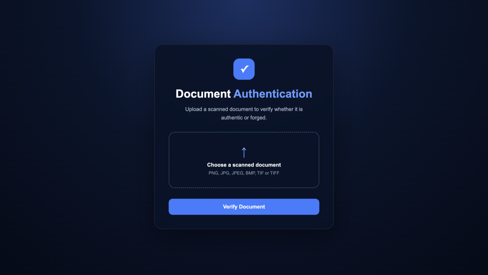
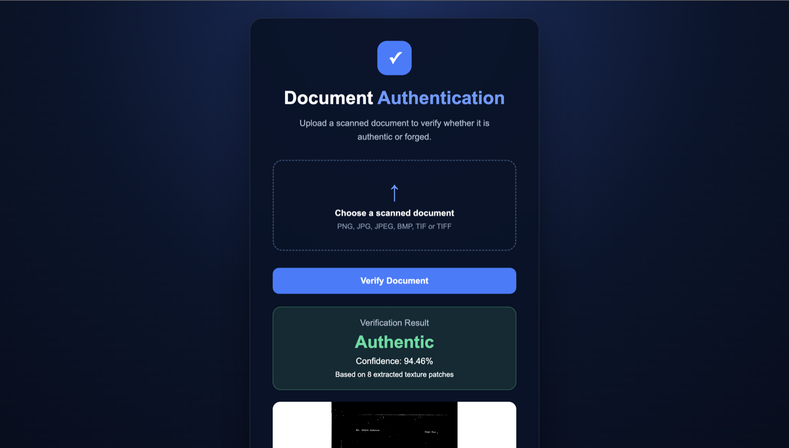
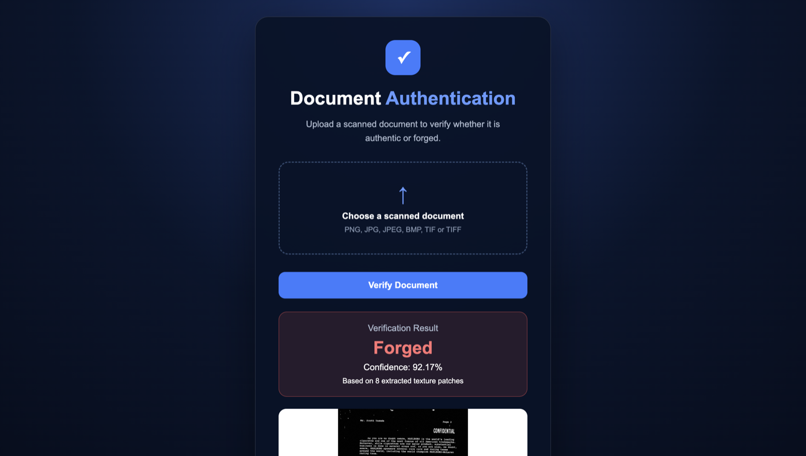
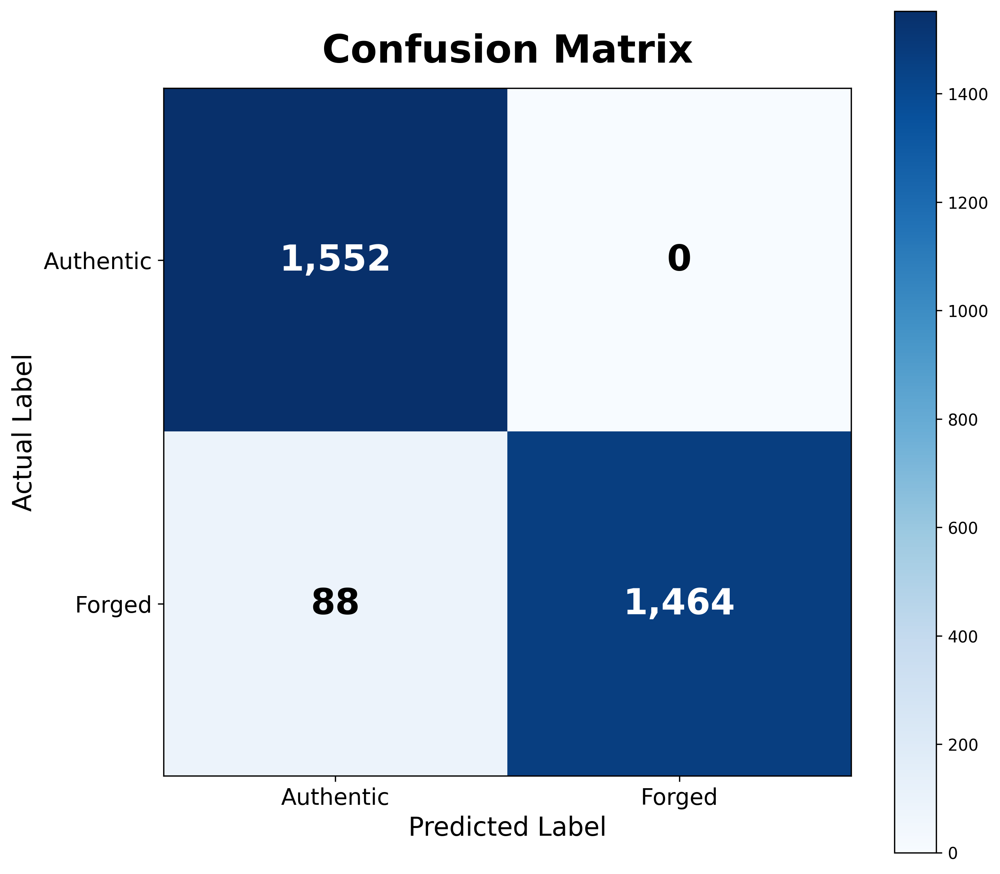
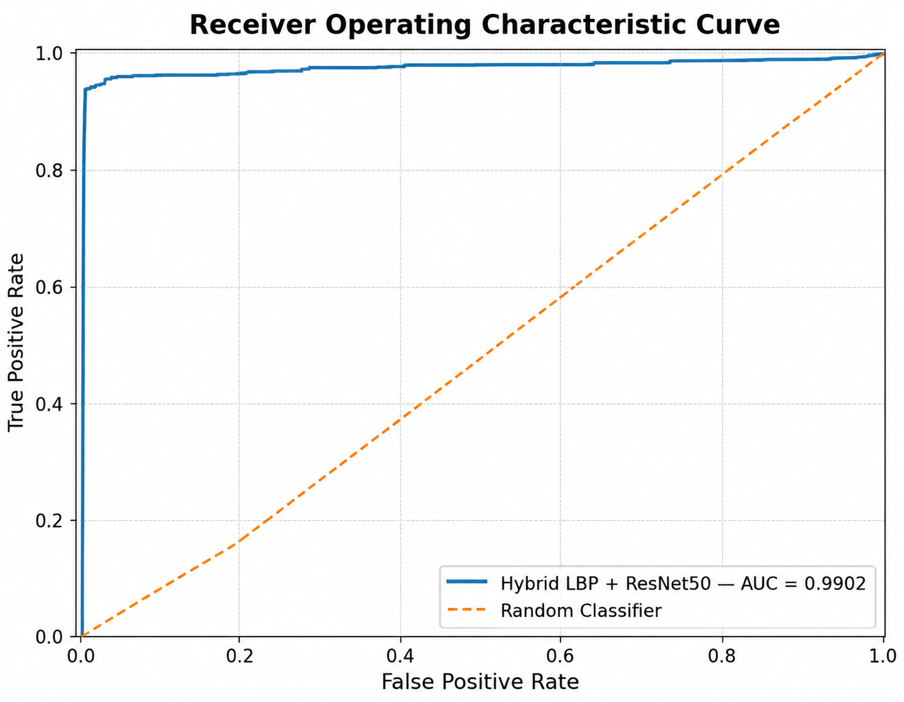

# Hybrid LBP–ResNet50 for Forensic Document Authentication

A deep learning–based forensic approach for detecting **reprinting forgery in scanned documents** through paper texture fingerprint analysis.

## Overview

This project investigates whether the physical paper characteristics preserved in a scanned document can be used as forensic evidence for document authentication.

The proposed approach combines **Local Binary Pattern (LBP)** texture analysis with a **ResNet50** convolutional neural network to classify scanned documents as **Authentic** or **Forged**.

The repository contains the trained model, experimental notebook, methodology figures, evaluation plots, and a Flask-based web interface for document verification.

## Research Pipeline

```text
Scanned Document
       ↓
Preprocessing
       ↓
Patch Extraction
       ↓
LBP Texture Representation
       ↓
Hybrid LBP + ResNet50 Model
       ↓
Authentic / Forged Classification
       ↓
Web-based Verification
```

## Web Application

The project includes a Flask-based web interface for document verification. The interface allows users to upload scanned documents and receive an authentication prediction based on the trained Hybrid LBP + ResNet50 model.

### Interface

#### Upload Interface

<p align="center">
  
</p>

#### Authentic Document Detection

<p align="center">
  
</p>

#### Forged Document Detection

<p align="center">
  
</p>

## Key Components

- **LBP (Local Binary Pattern):** Captures local micro-texture patterns associated with paper surface characteristics.
- **ResNet50:** Extracts deep visual features from processed document regions.
- **Hybrid Approach:** Combines handcrafted texture information with deep feature learning.
- **Patch-Based Analysis:** Focuses on localized paper texture rather than relying only on document-level appearance.
- **Flask Web Application:** Provides a simple interface for uploading and verifying scanned documents.
- **Git LFS:** Stores the trained `.keras` model because of its large file size.

## Model

The final trained Hybrid LBP + ResNet50 model is provided in the repository and tracked using Git LFS:

`model/paper_fingerprint_hybrid_lbp_resnet50_final.keras`

## Evaluation

The final dataset contains **20,640 samples**, divided into:

- **Training:** 14,448 samples
- **Validation:** 3,088 samples
- **Test:** 3,104 samples

The test set contains:

- 1,552 Authentic samples
- 1,552 Forged samples

### Classification Report

| Class                | Precision |   Recall | F1-score |   Support |
| -------------------- | --------: | -------: | -------: | --------: |
| Authentic            |      0.95 |     1.00 |     0.97 |     1,552 |
| Forged               |      1.00 |     0.94 |     0.97 |     1,552 |
| **Macro Average**    |  **0.97** | **0.97** | **0.97** | **3,104** |
| **Weighted Average** |  **0.97** | **0.97** | **0.97** | **3,104** |

### Final Test Results

| Metric        |       Score |
| ------------- | ----------: |
| **Accuracy**  |  **97.16%** |
| **Precision** | **100.00%** |
| **Recall**    |  **94.33%** |
| **F1-Score**  |  **97.08%** |
| **AUC**       |  **99.02%** |

The final Hybrid LBP + ResNet50 model achieved an overall test accuracy of **97.16%** and an **AUC of 99.02%**, demonstrating strong discrimination between authentic and reprinted forged documents on the held-out test set.

The repository includes confusion matrices, ROC and precision–recall curves, and training/validation performance plots for further analysis.

> **Note:** These results represent the current experimental model evaluated on the held-out test set. They should be interpreted as research results and not as a production-grade forensic certification system.

## Confusion Matrix

The normalized confusion matrix illustrates the classification performance of the final Hybrid LBP + ResNet50 model on the held-out test set.

<p align="center">
  
</p>

## ROC Curve

<p align="center">
  
</p>

The normalized confusion matrix shows that the model achieves strong classification performance across both authentic and forged document classes, with an overall test accuracy of **97.16%**.

## Repository Structure

```text
Hybrid-LBP-ResNet50/
│
├── figures/
│   ├── dataset_construction.pdf
│   ├── hybrid_architecture.pdf
│   ├── lbp_pipeline.pdf
│   ├── model_evaluation.pdf
│   ├── overall_methodology.pdf
│   ├── patch_extraction.pdf
│   ├── preprocessing_pipeline.pdf
│   ├── reprint_pipeline.pdf
│   ├── training_strategy.pdf
│   └── web_verification_workflow.pdf
│
├── model/
│   ├── graduation-using-lbp.ipynb
│   └── paper_fingerprint_hybrid_lbp_resnet50_final.keras
│
├── plots/
│   ├── confusion_matrix_counts.png
│   ├── confusion_matrix_normalized.png
│   ├── precision_recall_curve.png
│   ├── roc_curve.png
│   ├── training_validation_accuracy.png
│   └── training_validation_loss.png
│
├── web/
│   ├── app.py
│   ├── static/
│   │   └── style.css
│   └── templates/
│       └── index.html
│
├── .gitattributes
├── .gitignore
└── README.md
```

## Reproducibility

The main experimental workflow is documented in the Jupyter Notebook:

`model/graduation-using-lbp.ipynb`

The complete experimental workflow is also available on Kaggle:

**[View the Kaggle Notebook](https://www.kaggle.com/code/nadaabuzaid/graduation-using-lbp)**

The repository also includes methodology diagrams and evaluation plots documenting the experimental pipeline.

## Technologies

- Python
- TensorFlow / Keras
- ResNet50
- Local Binary Pattern (LBP)
- OpenCV
- NumPy
- Flask
- Kaggle Notebook
- Git / Git LFS

## Research Focus

This work explores the intersection of:

- Deep Learning
- Computer Vision
- Document Forensics
- Paper Texture Analysis
- Image Processing

The goal is to investigate automated detection of reprinting-based document forgery using paper texture fingerprints.

## Author

**Nada Abuzaid**

Cyber Security Engineer | Full Stack Developer

---

This repository represents an academic/research implementation intended for experimentation, evaluation, and further development.
